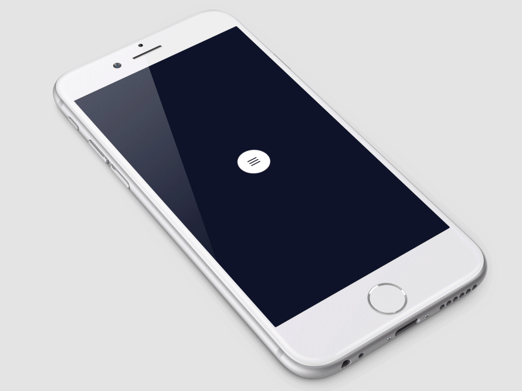

# SLCircleMenu

[shot on dribbble:](https://dribbble.com/shots/2534780-Circle-Menu-Swift-Open-Source)


## Overview

SLCircleMenu是一个比较炫酷的菜单选择器，效果见上面的gif动图
具体用法见项目中的demo
改项目是本人参照Ramotion/circle-menu制作的OC版本，原swift版见地址[这里](https://github.com/Ramotion/circle-menu)

## Usage


##### programmatically

```objective-c
SLCircleMenu *menuButton = [[SLCircleMenu alloc] initWithFrame:CGRectMake([UIScreen mainScreen].bounds.size.width / 2 - 50 / 2, [UIScreen mainScreen].bounds.size.height / 2 - 50 / 2, 50, 50) imageName:@"icon_menu" selectedImageName:@"icon_close" buttonCount:5 duration:2 distance:120];
    menuButton.backgroundColor = [UIColor lightGrayColor];
    menuButton.delegate = self;
    menuButton.layer.cornerRadius = menuButton.frame.size.width / 2.0;
    [self.view addSubview:menuButton];
```

##### delegate methods

```objective-c
//子按钮出现前，可以设置图片和颜色之类
- (void)circleMenu:(SLCircleMenu *)circleMenu willDisplayButton:(SLCircleMenuButton *)button atIndex:(NSInteger)index;
//子按钮刚被点击的时候
- (void)circleMenu:(SLCircleMenu *)circleMenu buttonWillSelected:(SLCircleMenuButton *)button atIndex:(NSInteger)index;
//子按钮点击动画完成
- (void)circleMenu:(SLCircleMenu *)circleMenu buttonDidSelected:(SLCircleMenuButton *)button atIndex:(NSInteger)index;
```

## Licence

Circle menu is released under the MIT license.

